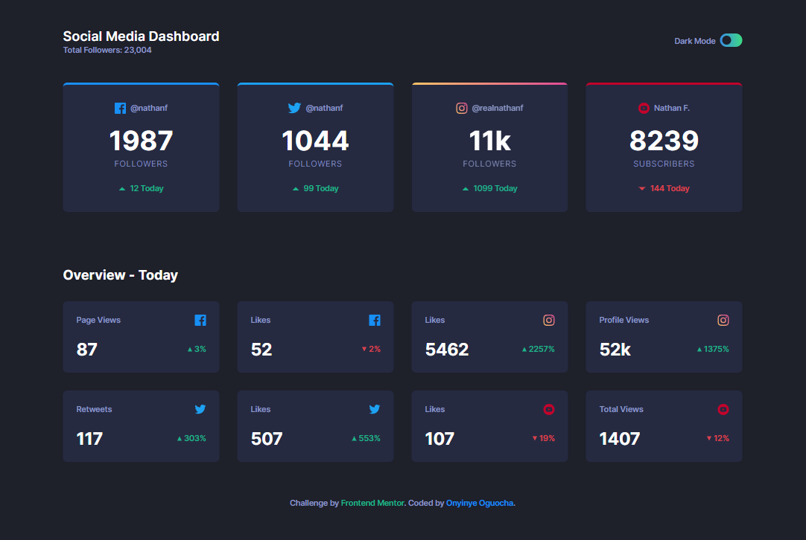
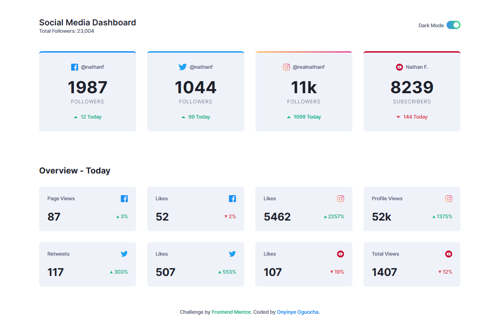
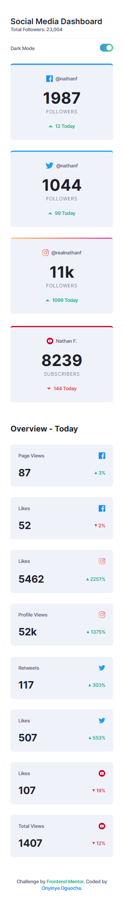
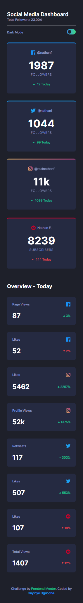

# Frontend Mentor - Social media dashboard with theme switcher solution

This is a solution to the [Social media dashboard with theme switcher challenge on Frontend Mentor](https://www.frontendmentor.io/challenges/social-media-dashboard-with-theme-switcher-6oY8ozp_H). Frontend Mentor challenges help you improve your coding skills by building realistic projects. 

## Table of contents

- [Overview](#overview)
  - [The challenge](#the-challenge)
  - [Screenshot](#screenshot)
  - [Links](#links)
- [My process](#my-process)
  - [Built with](#built-with)
  - [What I learned](#what-i-learned)
  - [Continued development](#continued-development)
  - [Useful resources](#useful-resources)
- [Author](#author)
- [Acknowledgments](#acknowledgments)


## Overview

### The challenge

Users should be able to:

- View the optimal layout for the site depending on their device's screen size
- See hover states for all interactive elements on the page
- Toggle color theme to their preference

### Screenshot







### Links

- Solution URL: [Live Demo](https://github.com/stephany247/social-media-dashboard-with-theme-switcher)
- Live Site URL: [Github Repo](https://social-media-dashboard-with-theme-switcher-gray-delta.vercel.app/)

## My process

### Built with

- Semantic HTML5 markup
- CSS custom properties
- Flexbox
- CSS Grid
- Mobile-first workflow
- [React](https://reactjs.org/) - JS library
- [Tailwind CSS](https://tailwindcss.com/docs/installation) - For styles


### What I learned

I learned how to persist the selected theme (dark or light) using React’s useState and useEffect, storing the value in localStorage.

```js

const [isDark, setIsDark] = useState(() => {
    const storedTheme = localStorage.getItem("theme");
    return storedTheme === "dark";
  });

  useEffect(() => {
    if (isDark) {
      document.body.classList.add("dark");
      document.body.classList.remove("light");
      localStorage.setItem("theme", "dark");
    } else {
      document.body.classList.add("light");
      document.body.classList.remove("dark");
      localStorage.setItem("theme", "light");
    }
  }, [isDark]);

```


### Continued development

As I continue to refine my frontend development skills, here are some areas I want to improve in future projects:
- Improve theme management by using CSS variables and detecting system preferences.
- Enhance UI transitions, especially gradient effects and animations.
- Focus on accessibility, ensuring better ARIA support.

### Useful resources

- [React Documentation](https://reactjs.org/docs/getting-started.html) - Official React documentation.
- [Tailwind CSS Documentation](https://tailwindcss.com/docs) - Official Tailwind CSS documentation.
- [MDN Web Docs](https://developer.mozilla.org/en-US/) - Comprehensive resource for web development documentation.

## Author

- Website - [Onyinye Stephanie Oguocha](https://www.your-site.com)
- Frontend Mentor - [stephany247](https://www.frontendmentor.io/profile/stephany247)
- Twitter - [@stephanyoguocha](https://x.com/stephanyoguocha)

## Acknowledgments

I would like to thank the following resources and individuals for their support and inspiration:

- [Frontend Mentor](https://www.frontendmentor.io) - For providing the project challenge.
- [React](https://reactjs.org) - For the amazing library.
- [Tailwind CSS](https://tailwindcss.com) - For the utility-first CSS framework.
